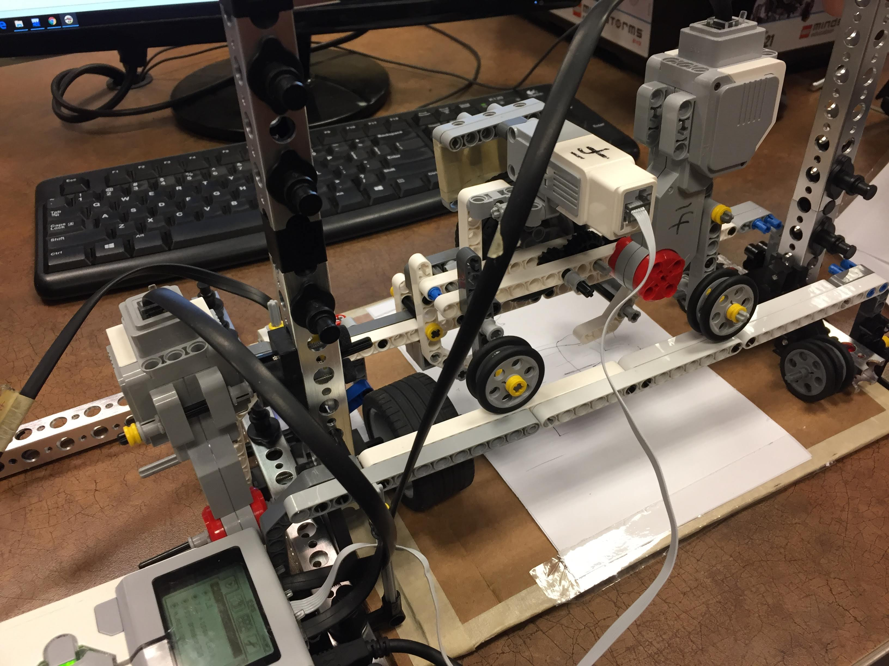
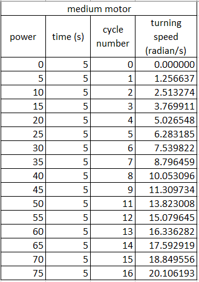
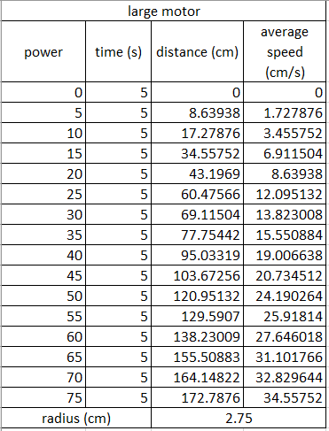

# GraphingRobot
A program that interprets a function and provides the information to a LEGO EV3 robot for it to draw the graph of that function. 
This was created by a group of University of Waterloo Mechatronics Students as a final project. It features a combination of C++ and RobotC.

Tests were run to figure out how much distance our robot would cover in a specified amount of time according to the motor power. This allowed us to gain a better understanding of how to coordinate the motors to draw out the graphs precisely. To be able to draw the graph, the motor that controls the movement horizontally and the motor that controls the movement vertically must be able to both work simultaneously to ensure that proper curves and slanted lines can be plotted.

